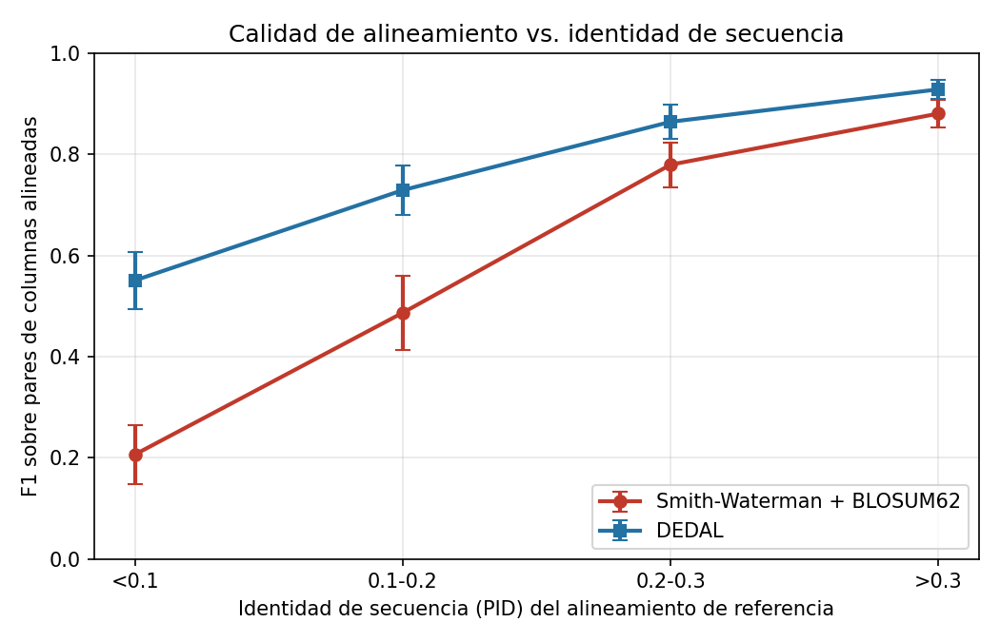
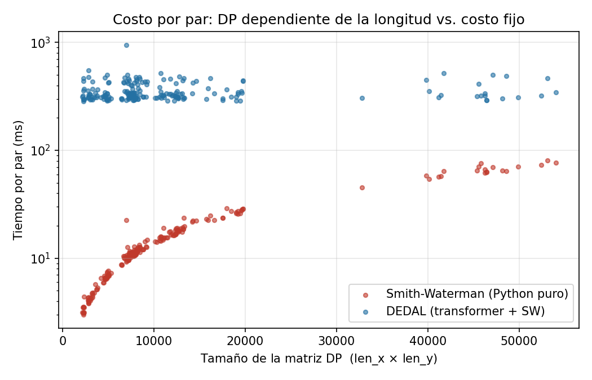

# Informe final — Implementación y comparación contra DEDAL

**Curso:** Bioinformática — EPCC, UNSA
**Docente:** Rolando Jesús Cárdenas Talavera
**Opción:** 2.1 — Trabajo de Investigación e Implementación
**Artículo analizado:** *Deep embedding and alignment of protein sequences* (Llinares-López et al., Google Research, **Nature Methods** 2023) — modelo **DEDAL**

El análisis del artículo (objetivos, metodología y resultados de los autores) está en [`ANALISIS.md`](ANALISIS.md). Este documento cubre los puntos 4 y 5 del enunciado: **nuestra implementación y la comparación contra la solución de los autores**.

---

## 1. Qué implementamos y por qué

El algoritmo que implementamos es **Smith-Waterman local con penalización de gap afín (Gotoh) y matriz de sustitución BLOSUM62**, en Python con NumPy. Está en [`proyecto/sw_affine.py`](proyecto/sw_affine.py).

Elegimos Smith-Waterman porque no es una analogía: **es literalmente la última capa de DEDAL**. Los autores no reemplazan el algoritmo clásico, sino que le cambian los parámetros de entrada. Eso hace que la comparación sea exacta — mismo algoritmo, distinta forma de puntuarlo — y no una comparación entre dos métodos que hacen cosas distintas.

### Por qué no pudimos reutilizar el código de los laboratorios

Esto nos tomó por sorpresa al empezar. Nuestros labs previos no servían tal cual por dos razones:

| | Laboratorios | Lo que exige la comparación |
|---|---|---|
| Alfabeto | ADN (4 letras) | Proteínas (20+ aminoácidos) |
| Puntaje | `match=+2 / mismatch=−1` | Matriz de sustitución BLOSUM62 (24×24) |
| Gap | Lineal (`−2` por posición) | Afín (apertura ≠ extensión) |

DEDAL es **solo de proteínas** y usa gaps afines, así que un SW de ADN con match/mismatch no se puede comparar contra él de ninguna manera sensata.

Lo que sí hicimos fue **combinar dos cosas que ya habíamos visto por separado**:

- del **lab_02**, el alineamiento **local**: la opción del cero en la recurrencia y el traceback que se detiene al llegar a cero;
- del **lab_04**, el **gap afín de Gotoh**: las tres matrices `M / Ix / Iy`, que hacen falta porque el costo de un gap depende de si es el primero o una continuación;
- y añadimos lo que ningún laboratorio tenía: la **matriz de sustitución**.

La recurrencia que implementamos:

```
Ix[i,j] = max( M[i-1,j] - gap_open ,  Ix[i-1,j] - gap_extend )
Iy[i,j] = max( M[i,j-1] - gap_open ,  Iy[i,j-1] - gap_extend )
M[i,j]  = max( 0 , max(M,Ix,Iy)[i-1,j-1] + BLOSUM62[x_i, y_j] )
```

Un gap de longitud *k* cuesta `gap_open + (k−1)·gap_extend`. El orden de desempate del traceback está fijado en `M > Ix > Iy` y documentado en el código, para que los resultados sean reproducibles.

La matriz BLOSUM62 la tomamos de la constante `BLOSUM_62` que viene embebida en el propio código de los autores (`models/initializers.py`), de modo que ambos métodos se puntúan contra exactamente la misma tabla.

---

## 2. Cómo montamos la comparación

### Datos de referencia

Usamos **alineamientos seed de Pfam**, que es la misma fuente de *ground truth* del paper. Los descargamos por la API de InterPro (`proyecto/pfam_data.py`).

> Nota práctica: el sitio histórico `pfam.xfam.org` **ya no existe** — Pfam se absorbió dentro de InterPro en 2022. Toda la documentación que encontramos al principio apuntaba a URLs muertas.

Elegimos **18 familias** midiendo primero su distribución real de identidad, no a ojo. Fue necesario: la mayoría de familias de Pfam viven por encima del 15% de identidad, y sin incluir a propósito familias de identidad baja (`PF00104`, `PF00583`) la banda `<0.1` se quedaba con unos cinco pares, que no da para concluir nada.

Descartamos familias con dominios de más de 512 residuos (DEDAL los trunca en silencio) y de menos de ~40 (con tan pocas columnas el F1 salta en cuantos gruesos).

### Conjunto de evaluación

**200 pares**, en cuatro bandas de identidad de **50 pares cada una**. El muestreo es estratificado a propósito: si sorteáramos pares al azar, casi todos caerían en identidad alta y perderíamos justamente la región donde está el resultado del paper.

Filtros aplicados: secuencias ≤ 510 residuos, al menos 20 columnas alineadas, y descartamos pares con identidad > 0.9 (filas casi duplicadas que inflan a ambos métodos por igual).

### Métrica

Representamos cada alineamiento como el **conjunto de pares de índices `(i, j)`** que pone en estado de match, y medimos concordancia contra la referencia:

- **precisión** = `|pred ∩ ref| / |pred|`
- **recall** = `|pred ∩ ref| / |ref|`
- **F1** = media armónica

No hay crédito parcial: alinear el residuo `i` con `j+1` cuenta como falso positivo *y* como falso negativo.

La identidad (PID) de cada par se calcula siempre sobre el alineamiento **de referencia**, nunca sobre el predicho — si se calculara sobre la predicción, cada método definiría sus propias bandas y las curvas no serían comparables. Para eso usamos `pid_from_matches`, la función de los propios autores.

---

## 3. Resultados

### F1 por banda de identidad

| Banda PID | n | SW + BLOSUM62 | DEDAL | brecha |
|---|---|---|---|---|
| **< 0.1** | 50 | 0.206 ± 0.059 | **0.551 ± 0.057** | **+0.344** |
| 0.1 – 0.2 | 50 | 0.487 ± 0.073 | 0.729 ± 0.049 | +0.243 |
| 0.2 – 0.3 | 50 | 0.780 ± 0.044 | 0.864 ± 0.033 | +0.085 |
| > 0.3 | 50 | 0.881 ± 0.028 | 0.929 ± 0.019 | +0.048 |

(± es la mitad de un intervalo de confianza al 95%, aproximación normal.)



**Reprodujimos el resultado central del paper.** Ambas curvas suben monótonamente con la identidad, y la brecha se cierra monótonamente: de **+0.344** en homología remota a **+0.048** cuando las secuencias ya se parecen. En la banda `>0.3` los intervalos de confianza casi se solapan — ahí el método clásico ya funciona bien y el aprendizaje profundo aporta poco.

### Precisión vs. recall: cómo falla exactamente el método clásico

Esta tabla nos pareció lo más revelador del trabajo, y no la esperábamos:

| Banda PID | SW precisión | SW recall | DEDAL precisión | DEDAL recall |
|---|---|---|---|---|
| **< 0.1** | 0.383 | **0.154** | 0.599 | 0.527 |
| 0.1 – 0.2 | 0.718 | 0.407 | 0.751 | 0.714 |
| 0.2 – 0.3 | 0.848 | 0.737 | 0.872 | 0.859 |
| > 0.3 | 0.903 | 0.861 | 0.932 | 0.926 |

En identidad baja, Smith-Waterman tiene precisión 0.383 pero recall **0.154**. No está alineando mal al azar: está alineando **muy poco**. En un par concreto que inspeccionamos, la referencia tenía 203 columnas y nuestro SW devolvió solo 47 — de las cuales 35 eran correctas.

La explicación es el propio diseño del alineamiento local. Con una matriz fija, en cuanto la señal se debilita el puntaje acumulado cae por debajo de cero y la recurrencia reinicia. El algoritmo se refugia en el núcleo corto donde todavía hay señal clara y **abandona el resto del dominio**. DEDAL, con puntajes ajustados a ese par concreto, mantiene señal positiva a lo largo de todo el dominio y su recall se dispara de 0.154 a 0.527.

Es decir: la ventaja de DEDAL en homología remota **no es que acierte más en donde ambos miran, sino que se atreve a mirar donde el clásico se rinde.**

### El ajuste de gaps casi no importa

Barrimos `gap_open ∈ {9,10,11,12,13} × gap_extend ∈ {1,2}` sobre 60 pares reservados (`proyecto/tune_gaps.py`):

| | F1 medio |
|---|---|
| Mejor configuración (9, 2) | 0.5814 |
| Peor configuración (12, 2) | 0.5680 |
| Por defecto de NCBI (11, 1) | 0.5785 |

Todo el rango del barrido son **0.013 puntos de F1**. Con los parámetros óptimos, el F1 del baseline en la banda crítica sube de 0.200 a apenas **0.206** — mientras que la brecha contra DEDAL en esa banda es de **0.344**.

Esto sostiene empíricamente el argumento del paper: la diferencia **no es cuestión de calibrar parámetros**. Un orden de magnitud separa lo que se gana ajustando gaps de lo que se gana usando contexto.

### Tiempos

| | Mediana por par | Rango |
|---|---|---|
| Smith-Waterman (Python puro) | 11.5 ms | 3.0 – 80.5 ms |
| DEDAL (transformer + SW) | 326.1 ms | 285.1 – 945.5 ms |

Sobre 200 pares de 47 a 250 aminoácidos. Descartamos la primera llamada a DEDAL, que traza el grafo de TensorFlow y cuesta varios segundos.



Lo interesante no es cuál gana, sino **la forma de cada costo**: el de SW crece con `len_x × len_y`, mientras que el de DEDAL es prácticamente plano — el modelo rellena toda entrada a 512 posiciones, así que alinear dos dominios de 50 residuos le cuesta lo mismo que alinear dos de 500. Volvemos sobre esto en la sección 6, porque la comparación tiene trampa.

---

## 4. Ventajas de nuestra implementación

- **Auditable línea por línea.** Las tres matrices y el traceback se pueden imprimir e inspeccionar. En DEDAL el paso final sí es SW estándar, pero de dónde salen los puntajes de sustitución es una red neuronal con millones de parámetros.
- **Sin dependencias pesadas.** NumPy y nada más. DEDAL necesita TensorFlow, TensorFlow Hub y descargar un modelo de cientos de MB.
- **Costo proporcional a la entrada real.** Para dominios cortos somos ~28× más rápidos por par, porque no pagamos el relleno a 512.
- **Sin límite de longitud.** DEDAL trunca en silencio cualquier secuencia de más de 512 residuos; nosotros no tenemos ese techo.
- **Reproducible al bit.** Mismos parámetros, mismo resultado siempre. Y funciona sin conexión.

## 5. Desventajas frente a DEDAL

- **Colapsa en homología remota**, que es exactamente el caso que importa en la práctica: F1 0.206 contra 0.551, con un recall de 0.154 que significa que ignoramos el 85% del dominio.
- **La matriz fija es un promedio.** BLOSUM62 codifica cuánto vale en general cambiar un aminoácido por otro, sobre todas las proteínas conocidas. DEDAL calcula cuánto vale **en este par concreto** — por eso, como muestran los autores en su Figura 3, puede premiar las cisteínas que forman puentes disulfuro y castigar los triptófanos que BLOSUM premiaría por costumbre estadística.
- **No aporta detección de homología.** Nuestro puntaje de SW no es un criterio de decisión: no es un e-value, y no es comparable entre pares de longitudes distintas. DEDAL entrega además un logit de homología entrenado explícitamente para eso.

---

## 6. Honestidad metodológica

Esta sección recoge las limitaciones que encontramos en nuestro propio experimento. Ninguna invalida el resultado principal, pero todas acotan cuánto se puede afirmar a partir de él.

### 6.1 Nuestro baseline es más débil que el del paper

Los autores no comparan contra un BLOSUM62 cualquiera: toman el **mejor de ~1400 combinaciones** de (matriz, gap_open, gap_extend) entre las familias BLOSUM, VTML y PFASUM, y la ganadora resultó ser **PFASUM60, no BLOSUM62**.

Nosotros barrimos 10 configuraciones de gap sobre una sola matriz. Nuestro baseline juega en desventaja frente al suyo, y por lo tanto **la brecha que medimos es un límite superior de la brecha real**.

Lo que sí podemos decir es que el barrido de gaps mueve el F1 en 0.013 mientras la brecha es de 0.344 — así que es implausible que cambiar de matriz cierre la diferencia. Pero eso es un argumento de plausibilidad, no una medición: no probamos PFASUM60.

### 6.2 Probablemente evaluamos a DEDAL sobre sus propios datos de entrenamiento

**Esta es la limitación más seria del trabajo, y la descubrimos al comparar nuestras cifras con las del paper.**

DEDAL fue entrenado con los *seed alignments* de **Pfam-A 34.0**. Nosotros evaluamos con los seeds de la versión actual de Pfam servida por InterPro. Familias clásicas como `PF00014` o `PF00046` llevan décadas estables, así que es muy probable que **muchos de nuestros 200 pares estuvieran en el conjunto de entrenamiento del modelo**.

La evidencia numérica apunta en esa dirección. En la banda `<0.1`, el paper reporta:

| | F1 en PID ≤ 0.1 |
|---|---|
| Paper, *in-distribution* | 0.587 |
| Paper, *out-of-distribution* (clanes nuevos) | 0.329 |
| **Nosotros** | **0.551** |

Nuestro número se parece al *in-distribution*, no al OOD. Eso es exactamente lo que se esperaría si el modelo ya conocía estos dominios.

**Consecuencia:** nuestro experimento mide qué tan bien alinea DEDAL dominios que probablemente ya vio, no qué tan bien generaliza. Los propios autores documentan que su desempeño cae casi a la mitad al salir del espacio de entrenamiento, y reconocen "cierto grado de memorización de motivos específicos de clan". Nuestra réplica **no captura esa caída**, porque no hicimos partición por clanes.

Para corregirlo habría que descargar Pfam 34.0, identificar los clanes usados en entrenamiento y evaluar solo sobre clanes ausentes. No lo hicimos por tiempo, y preferimos declararlo antes que presentar 0.551 como si fuera una medida de generalización.

### 6.3 La comparación de tiempos no es una carrera justa

Tiene **dos** sesgos, en direcciones opuestas:

- **A favor nuestro:** DEDAL rellena toda entrada a 512 posiciones pase lo que pase. Nuestros dominios son de 47 a 250 residuos, así que el modelo desperdicia la mayor parte de su cómputo. Con secuencias cercanas a 512 la diferencia se reduciría mucho.
- **En contra nuestra:** nuestro SW es un doble bucle en **Python interpretado**. Una implementación equivalente en C (o vectorizada) sería fácilmente 50-100× más rápida. El número que reportamos mide nuestro código, no el algoritmo.

Reportamos los tiempos porque la *forma* de las curvas es informativa (costo fijo vs. costo cuadrático), pero **no debe leerse como "nuestro método es 28× más rápido"**. Esa frase sería falsa.

### 6.4 Escala

200 pares de 18 familias, frente a más de un millón de pares de prueba en el paper. Nuestros intervalos de confianza son anchos (±0.06 en la banda crítica) y los autores estiman su error estándar en menos de 0.0005. Reproducimos la tendencia; no reproducimos la precisión.

### 6.5 Lo que directamente no medimos

- **Detección de homología** (AUROC/AUPRC). Es la segunda tarea del paper y no la abordamos: haría falta construir pares negativos de familias no relacionadas.
- **Generalización OOD por clanes**, por lo explicado en 6.2.
- **Otras matrices de sustitución** (PFASUM, VTML).

### 6.6 Un sesgo que afecta a ambos por igual

El alineamiento seed de Pfam cubre el **dominio completo**, mientras que SW y DEDAL emiten alineamientos **locales** que pueden cubrir solo un tramo. Eso deprime el recall de los dos métodos, así que no sesga la comparación entre ellos — pero explica por qué ningún F1 llega a 1.0 ni siquiera en identidad alta, y conviene tenerlo presente antes de pensar que hay un error.

---

## 7. Qué aprendimos

**Sobre el método.** La idea de DEDAL no es reemplazar el algoritmo clásico sino *reparametrizarlo*, y eso nos pareció más elegante que un modelo end-to-end: la salida sigue siendo un alineamiento válido de Smith-Waterman, con la estructura de gaps coherente que garantiza la programación dinámica. El aprendizaje profundo se usa donde el método clásico era arbitrario — la matriz fija — y no donde ya era correcto.

**Sobre nuestro propio experimento.** La lección más incómoda fue la 6.2. Nuestras primeras cifras nos parecieron un éxito rotundo hasta que las contrastamos con las dos columnas del paper y notamos que nos parecíamos a la de *in-distribution*. Un resultado que confirma lo que uno espera merece más escrutinio, no menos.

**Sobre la depuración.** Antes de correr los 200 pares implementamos una prueba de sanidad: para un par de identidad alta, el F1 de SW tiene que superar 0.8. La primera versión de nuestro traceback grababa un match sobre la celda de puntaje cero donde el alineamiento local termina, metiendo un par espurio en cada resultado. Ese bug habría bajado las métricas de forma uniforme y sutil, y sin la prueba lo habríamos confundido con una propiedad del método.

---

## Anexo: cómo reproducir

```bash
python3 -m venv venv && source venv/bin/activate
pip install --upgrade pip && pip install -e . && pip install matplotlib

python -m proyecto.tune_gaps                                    # barrido de gaps
python -m proyecto.run_benchmark --per-bin 50 --gap-open 9 --gap-extend 2 \
       --out proyecto/results_tuned.csv                         # 200 pares
python -m proyecto.plots                                        # tablas y figuras
```

| Archivo | Contenido |
|---|---|
| `proyecto/sw_affine.py` | **El algoritmo implementado** (SW local + Gotoh) |
| `proyecto/blosum.py` | BLOSUM62 desde la constante embebida del paper |
| `proyecto/pfam_data.py` | Descarga y parseo de seeds de Pfam (Stockholm) |
| `proyecto/sampling.py` | Muestreo estratificado por identidad |
| `proyecto/metrics.py` | Precisión / recall / F1 sobre pares de columnas |
| `proyecto/run_benchmark.py` | Driver de la comparación |
| `proyecto/tune_gaps.py` | Barrido de penalizaciones de gap |
| `proyecto/plots.py` | Figuras y tablas resumen |
| `proyecto/results_tuned.csv` | Resultados por par (200 filas) |
| `test.ipynb` | Recorrido explicado de la inferencia de DEDAL |

Los alineamientos descargados se cachean en `proyecto/cache/`. Si la red no está disponible, basta con dejar ahí los `.sto` descargados a mano: el código lee la caché antes de salir a internet.
